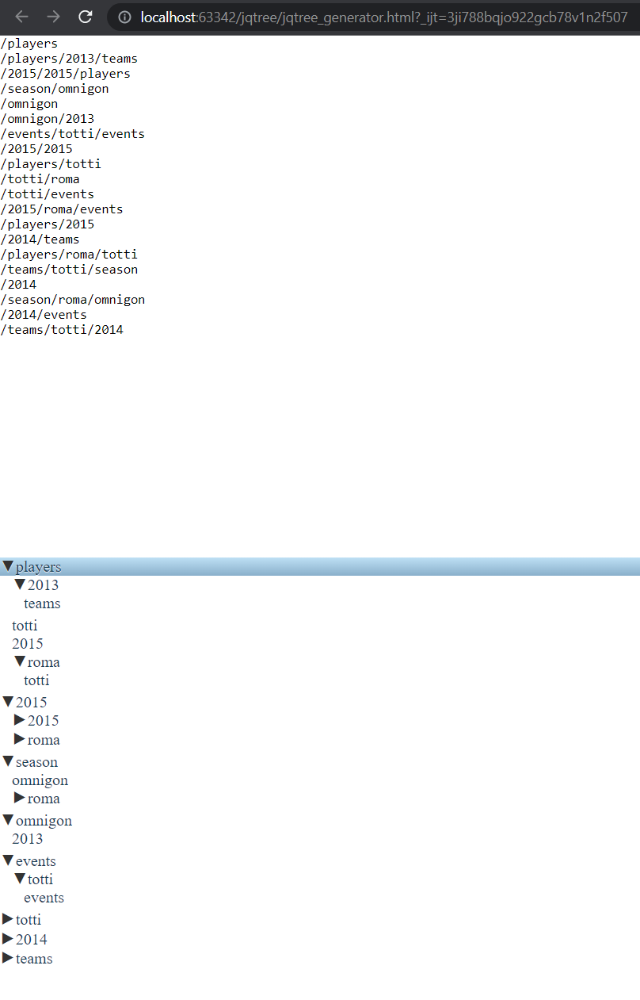

# jQuery Tree Generator

Demo: https://olegsuv-jqtree-generator.netlify.app/

## Demo task for Omnigon communication (Infront X), Jan 2015

1. Based on array of words, generating 20 strings of random paths
2. Displaying generated string into textarea
3. Building tree using jsTree (https://mbraak.github.io/jqTree/)

## Run

1. `npm i`
2. Open `jqtree_generator.html` in the browser

## 2022 Notes

File was unchanged keeping old styles and `var` declarations.
Just deleted unused file and keeping name convention of plugins author (with capital "T" in "jqTree").
Second part of test task (tweet.html) is inaccessible as API went down (http://api.massrelevance.com/reccosxof/matchtrax_hashclash_featured_tweets.json).